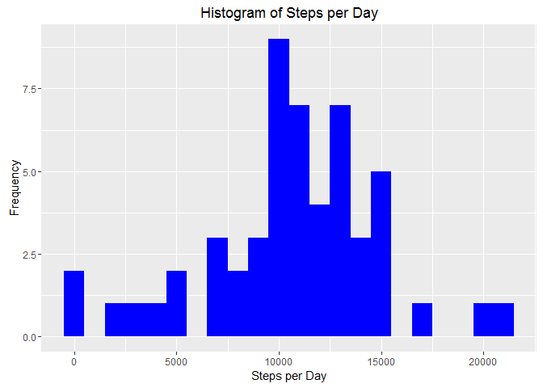
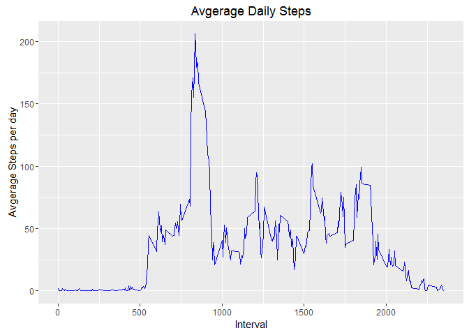
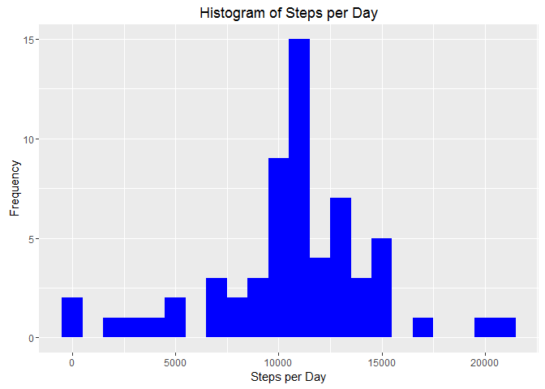
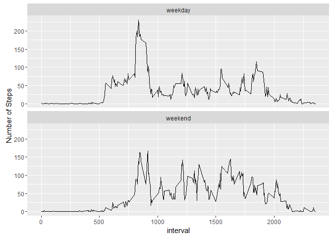

# Reproducible Research: Peer Assessment 1


## Loading and preprocessing the data
Unzip the file if needed and load the data in

```r
# Unzip activity file if it hasn't been done
if (!file.exists("activity.csv")) {
        unzip("activity.zip")}
# read in activity data
activity <- read.csv("activity.csv", colClasses = c("numeric", "character", "integer"))

library(lubridate)
```

```
## 
## Attaching package: 'lubridate'
```

```
## The following object is masked from 'package:base':
## 
##     date
```

```r
library(reshape2)
library(ggplot2)
```

```
## Warning: package 'ggplot2' was built under R version 3.3.1
```

```r
activity$date <- ymd(activity$date)
str(activity)
```

```
## 'data.frame':	17568 obs. of  3 variables:
##  $ steps   : num  NA NA NA NA NA NA NA NA NA NA ...
##  $ date    : Date, format: "2012-10-01" "2012-10-01" ...
##  $ interval: int  0 5 10 15 20 25 30 35 40 45 ...
```


## What is mean total number of steps taken per day?
Create the histogram for steps per day

```r
meltedSteps <- melt(activity, id = c("date"), na.rm = TRUE, measure.vars = "steps")
castedSteps <- dcast(meltedSteps, date ~ variable, sum)
ggplot(castedSteps, aes(x = steps)) + geom_histogram(fill = "blue", binwidth = 1000) + labs(title = "Histogram of Steps per Day", x = "Steps per Day", y = "Frequency")
```

<!-- -->

Calculate the mean and median of steps

```r
meanSteps <- mean(castedSteps$steps)
meanSteps
```

```
## [1] 10766.19
```

```r
medianSteps <- median(castedSteps$steps)
medianSteps
```

```
## [1] 10765
```

## What is the average daily activity pattern?
Calculate the average steps per day for each interval and create the time series plot

```r
meltedInterval <- melt(activity, id = c("interval"), na.rm = TRUE, measure.vars = "steps")
castedInterval <- dcast(meltedInterval, interval ~ variable, mean)
ggplot(castedInterval, aes(x =interval , y=steps)) +
        geom_line(color="blue") +
        labs(title = "Avgerage Daily Steps", x = "Interval", y = "Avgerage Steps per day")
```

<!-- -->

Check which interval has the maximum steps

```r
maxInterval <- castedInterval$interval[which.max(castedInterval$steps)]
maxInterval
```

```
## [1] 835
```

```r
castedInterval[which.max(castedInterval$steps),]
```

```
##     interval    steps
## 104      835 206.1698
```
## Imputing missing values
Calculate the number of missing values

```r
nas <- is.na(activity$steps)
sum(nas)
```

```
## [1] 2304
```
Create a new data set that is equal to the "activity" dataset but with the missing data filled in with the mean value of that 5min interval

```r
activityFull <- activity
meanInterval <- tapply(activity$steps, activity$interval, mean, na.rm = TRUE)
activityFull$steps[nas] <- meanInterval[as.character(activity$interval[nas])]
```

Create a histogram of the total number of steps taken each day

```r
meltedStepsFull <- melt(activityFull, id = c("date"), na.rm = TRUE, measure.vars = "steps")
castedStepsFull <- dcast(meltedStepsFull, date ~ variable, sum)
ggplot(castedStepsFull, aes(x = steps)) + geom_histogram(fill = "blue", binwidth = 1000) + labs(title = "Histogram of Steps per Day", x = "Steps per Day", y = "Frequency")
```

<!-- -->
Mean of the total steps

```r
mean(castedStepsFull$steps)
```

```
## [1] 10766.19
```

Median of the total steps

```r
median(castedStepsFull$steps)
```

```
## [1] 10766.19
```

Imputing missing values makes the mean and median values the same

## Are there differences in activity patterns between weekdays and weekends?

Update the dataset "activityFull" (missing value filled in) with the new level factor "wd" to indicate whether the date is a "weekday" or "weekend"

```r
activityFull$wd <- "weekday"
activityFull$wd[weekdays(activityFull$date) %in% c("Saturday", "Sunday")] <- "weekend"
activityFull$wd <- as.factor(activityFull$wd)
table(activityFull$wd)
```

```
## 
## weekday weekend 
##   12960    4608
```

Make a panel plot containing a time series plot of the 5-minute interval (x-axis) and the average number of steps taken, averaged across all weekday days or weekend days (y-axis)

```r
meltedwd <- melt(activityFull, id = c("interval", "wd"), na.rm = TRUE, measure.vars = "steps")
castedwd <- dcast(meltedwd, interval + wd ~ variable, mean)
p <- ggplot(castedwd, aes(x = interval, y = steps)) + geom_line() + ylab("Number of Steps")
p + facet_wrap(~wd, ncol = 1)
```

<!-- -->


